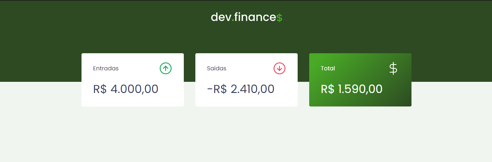

<h1>💰 Maratona Discover - <i>dev.finance$</i> 💰</h1>

 

---

 

<h2>Índice</h2>

<ul>
    <li><a href="#about">Sobre o projeto</a></li>
    <li><a href="#techs">Tecnologias Utilizadas</a></li>
    <li><a href="#goals">Ideias</a></li>
</ul>

 

---

 

<h2 id="about">📖 Sobre o projeto</h2>

 

&nbsp;&nbsp;&nbsp;&nbsp;O <strong>dev.finance$</strong> é uma aplicação experimental feita para ser executada no próprio navegador (<i>Desktop</i> ou <i>Mobile</i>) com o objetivo de organizar as finanças (entrada, saída, total e transações) de um usuário qualquer, permitindo uma visualização dos dados.

&nbsp;&nbsp;&nbsp;&nbsp;Faz parte da proposta da RocketSeat para 2021, que consiste em disponibilizar vídeo-aulas gratuitas, as quais darão a base teórica para que os alunos consigam acompanhar uma <strong>maratona</strong> para desenvolver uma aplicação real que coloque em prática o conteúdo adquirido.

&nbsp;&nbsp;&nbsp;&nbsp;Na <strong>Maratona Discover</strong>, onde desenvolvemos o sistema em questão, utilizamos <i>HTML5</i>, <i>CSS3</i> e <i>JavaScript</i> para construir o front e o back-end da aplicação. Além disso, utilizamos o Local Storage do navegador como banco de dados. Todo o código foi desenvolvido no Visual Studio Code.

&nbsp;&nbsp;&nbsp;&nbsp;Para visualizar o resultador, é possível acessar a página da aplicação <a href="https://magaliais.github.io/dev-finances/">aqui✔️</a>.

 

---

 

<h2 id="techs">👨‍💻 Tecnologias e Ferramentas Utilizadas</h2>

 

* HTML5;
* CSS3;
* JavaScript;
* Figma;
* Visual Code Studio;

 

---

 

<h2 id="goals">💡 Implementações Futuras</h2>

 

- [x] Adicionar um favicon à aba;
- [x] Adicionar o método checagem de total ao `DOM.updateBalance()`, a fim de verificar o saldo final e alternar a cor do card entre verde ou vermelho de acordo com o resultado final do balanço;
- [x] Adicionar a funcionalidade de deixar os dados das transações salvas no navegador para a próxima vez que o site seja acessado;
- [ ] Adicionar `toggleTheme()` para alternar a aplicação entre modo noturno ou diurno;
- [ ] Implementar possibilidade de <strong>editar</strong> uma transação já adicionada;
- [ ] Adicionar input ao modal de cadastrar Nova Transação, que possibilita a categorização do tipo de transação realizada (Lazer, Doméstico, Estudo, etc);
